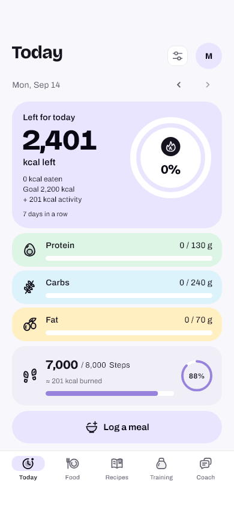
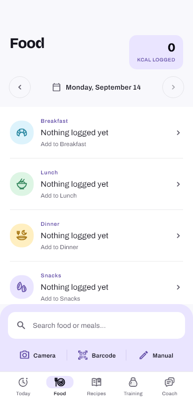
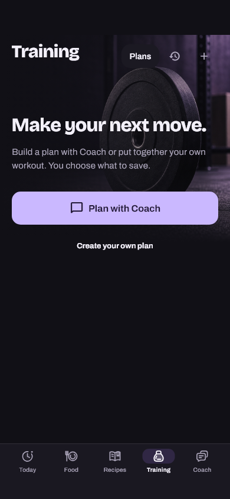

# Eatova

Nutrition, meal planning and training in one Flutter app for Android and iOS.

[](https://github.com/mxritzgit/Eatova/actions/workflows/security.yml)
[](CONTRIBUTING.md)
[](LICENSE)

Eatova combines a daily calorie and macro dashboard, a food diary, editable
recipes, a weekly meal plan and shopping list, guided workouts and an AI coach.
The five tabs are **Today · Food · Recipes · Training · Coach**. German and
English are supported throughout the app, including sign-in and account flows.

| Today | Food | Training |
| --- | --- | --- |
|  |  |  |

Actual Flutter renders with fixture data. More previews and implementation
notes are in the [documentation index](docs/README.md).

## Project status

This documentation describes the source on `main`, checked on **2026-09-14**
through [PR #88](https://github.com/mxritzgit/Eatova/pull/88). The package is
`eatova`; `pubspec.yaml` declares **1.1.0+3**. Newer merged work is recorded
under **Unreleased** in [CHANGELOG.md](CHANGELOG.md).

A merged commit, deployed Supabase functions and an installed/store build are
separate delivery steps. See the [backend guide](docs/BACKEND.md) and dated
[handoff records](docs/PROJECT_HANDOFF.md) for deployment evidence.

## Features

- **Today:** remaining calories, macro progress bars, logging streak and a
  connected step count. Profile and Settings are opened from this tab.
- **Food:** camera/gallery meal analysis with optional context, barcode lookup,
  product search, manual nutrition entry, editable portions, favorites and a
  calendar for the selected diary date. Trends show weight, calories and macros
  over 7/30/90 days.
- **Recipes:** a recipe catalog and editable own/adopted recipes with photos,
  preparation steps, structured ingredients and fractional servings. Add a
  portion to the diary or schedule it in the meal plan.
- **Meal Plan and Shopping List:** plan meals by week, day and meal slot;
  aggregate compatible ingredient quantities and keep checked items. Planned
  meals affect the food diary only after an explicit consumption action.
- **Training:** create/select/edit plans with multiple workouts, repetitions or
  timed sets. The player supports rest intervals, pause/resume and a local
  recovery checkpoint. Completed sessions store actual set values and immutable
  history; previous results are available as “Last time”.
- **Coach:** conversations with sessions, image input, optional iOS
  dictation, nutrition context and a server-enforced daily quota. `/recipe`
  creates a recipe proposal with an image; `/plan` uses an explicit training
  brief and can discuss/adapt a selected plan. Saving a proposal requires
  confirmation. Replies use SSE transport and are released after the complete
  provider response passes server-side checks; the thinking state stays visible
  while that validation is pending.
- **Profile and Settings:** body values, daily goals, weight history, lifetime
  statistics, health connection, language/theme, JSON export, account changes
  and account deletion with email verification.
- **Offline use:** account-scoped encrypted local data and a durable sync outbox
  preserve supported edits across restarts. AI and fresh remote lookups require
  a connection. Recipe pictures stay on the device.
- **Health and reminders:** Apple HealthKit steps and weight on iOS; read-only
  Health Connect steps on Android. One local evening reminder helps protect the
  logging streak.

The [feature and platform matrix](docs/FEATURES.md) documents current behavior,
entry points and limitations, including Android weight sync and export sharing.

## AI models

All AI requests run through Supabase Edge Functions and **OpenRouter**. Current
source defaults are:

| Use | Model ID | Server override |
| --- | --- | --- |
| Meal photo analysis | `google/gemini-3.8-flash` | `OPENROUTER_MODEL` |
| Coach replies, recipe text and training drafts | `google/gemini-3.8-flash` | `COACH_MODEL_ANSWER` |
| Coach safety/topic classifier | `google/gemini-3.8-flash` | `COACH_MODEL_CLASSIFIER` |
| Generated recipe pictures | `google/gemini-3.1-flash-image` | `COACH_IMAGE_MODEL` |

Grok is no longer the configured default. Server overrides can change the
effective model independently of a client build. See
[Backend](docs/BACKEND.md#ai-configuration) for sources and deployment checks.

## Tech stack

| Layer | Implementation |
| --- | --- |
| Client | Flutter **3.47.2**, Dart **3.13.2**; Android and iOS |
| Localization | Flutter `gen_l10n`, German/English ARB files |
| UI | Shared theme tokens, Bricolage Grotesque/Archivo, original vector icons, light/dark themes |
| Backend | Supabase Auth, Postgres with RLS, Deno Edge Functions |
| Product lookup | Self-hosted Meilisearch/Open Food Facts index; public OFF fallback |
| AI | OpenRouter with separate Gemini text/vision and image models |
| Local persistence | Encrypted cache, OS-keystore key, durable account-scoped outbox |
| Health | HealthKit on iOS; Health Connect steps on Android |
| Diagnostics | Optional Sentry, enabled by build configuration and sanitized before sending |

## Architecture

```text
Flutter screens / widgets / theme
              |
       HomeStore + models
              |
     services + local cache/outbox
              |
              +-- Supabase Auth + Postgres/RLS
              +-- Edge Functions --> OpenRouter --> Gemini models
              +-- Meilisearch / Open Food Facts
              +-- HealthKit / Health Connect
              +-- Local notifications / optional Sentry
```

AI provider credentials remain server-side. The client receives public client
configuration and limited search credentials. Account data is protected at both
the RLS boundary and the local account namespace.

## Project structure

| Path | Responsibility |
| --- | --- |
| `lib/src/app/` | App shell, auth gate, HomeStore and feature-specific store parts |
| `lib/src/auth/`, `lib/src/config/` | Authentication and build-time client configuration |
| `lib/src/screens/` | Today, Food, recipes/meal plan, training, Coach, profile and settings |
| `lib/src/models/`, `lib/src/services/` | Domain data, persistence, sync and external integrations |
| `lib/src/theme/`, `lib/src/widgets/` | Shared design tokens, original icons and reusable UI |
| `lib/l10n/` | German/English source strings; generated output is ignored |
| `test/` | Unit, widget, flow, repository-rule and migration tests |
| `supabase/functions/`, `supabase/migrations/` | Three Edge Functions and versioned database changes |
| `docs/` | Current guides, design contracts, previews and dated delivery records |

## Getting started

Use the CI-pinned Flutter SDK. Android builds require the Android toolchain;
iOS builds require macOS/Xcode. The app minimums are Android API 26 and iOS 15;
Health Connect availability is checked separately on each device.

### Point at your own Supabase project

```bash
flutter pub get
cp dart_defines.example.json dart_defines.json
# Fill in your project's public SUPABASE_URL and SUPABASE_ANON_KEY.
flutter run --dart-define-from-file=dart_defines.json
```

The repository contains public defaults for the maintained Eatova service.
Configure your own backend for independent development. Keep the local defines
file out of Git and never add management, service-role or AI provider secrets
to a Flutter build. An explicitly empty define overrides its source default.

See [Development and builds](docs/DEVELOPMENT.md) for client configuration,
Google Sign-In, search fallback, Sentry and signed Android release builds.

## Backend

The endpoints are `analyze-meal`, `coach-chat` and `search-key`. Apply the
versioned migrations to your own project and configure the needed function
secrets before deploying. Schema changes and function deployments are separate.

- [Backend configuration and operations](docs/BACKEND.md)
- [Google sign-in setup](supabase/OAUTH_SETUP.md)
- [Email OTP contract and historical configuration](supabase/AUTH_EMAIL_OTP.md)
- [Generated schema access map](supabase/SCHEMA_STATE.md)

### Product-search key rotation

See the [runtime credential and rotation guide](docs/BACKEND.md#product-search-key-rotation),
including tenant tokens, cache refresh, fallback and server/client disable switches.

## Testing

```bash
flutter analyze --fatal-infos --fatal-warnings
flutter test --coverage \
  --dart-define=SUPABASE_URL=https://ci.invalid \
  --dart-define=SUPABASE_ANON_KEY=ci-dummy-key
```

[CONTRIBUTING.md](CONTRIBUTING.md) lists the Deno and database checks, the
**88% coverage floor**, documentation-only validation and repository conventions.
Tests use dummy configuration and stub external requests.

## Continuous integration

[security.yml](.github/workflows/security.yml) runs for main pushes, PRs to main,
weekly and on demand. It checks strict Flutter analysis/tests/coverage, Android
debug APK and release AAB/R8 builds, secrets, dependencies, Deno lint/type/unit
tests and cross-account RLS against disposable Postgres. The production
migration comparison runs only on `main`; PRs receive a separate required gate.

[ios.yml](.github/workflows/ios.yml) builds without code signing when iOS files,
the pubspec/lockfile or that workflow change, and on its schedule/manual trigger.
CI artifacts do not establish a store release or a device installation.

## Documentation and contributing

Start with the [documentation index](docs/README.md). Contributions follow
[CONTRIBUTING.md](CONTRIBUTING.md); report vulnerabilities privately using
[SECURITY.md](SECURITY.md). Data flows are described in [PRIVACY.md](PRIVACY.md).

## License

[MIT](LICENSE) · © 2026 Moritz Gietl.

Eatova provides general nutrition and fitness information, not medical advice.
