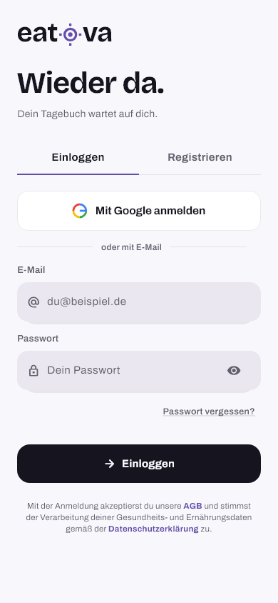
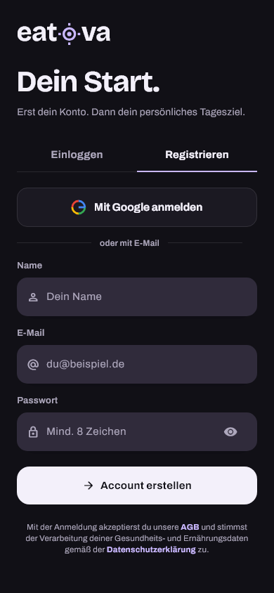
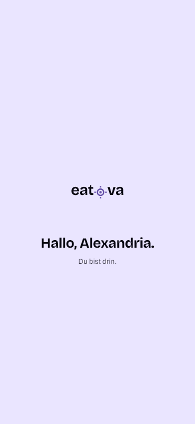
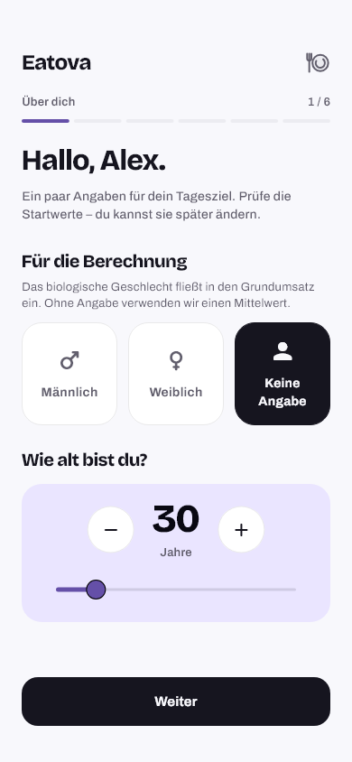
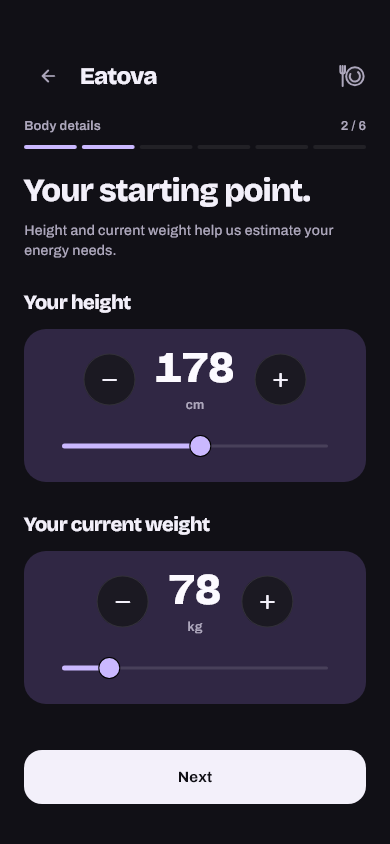
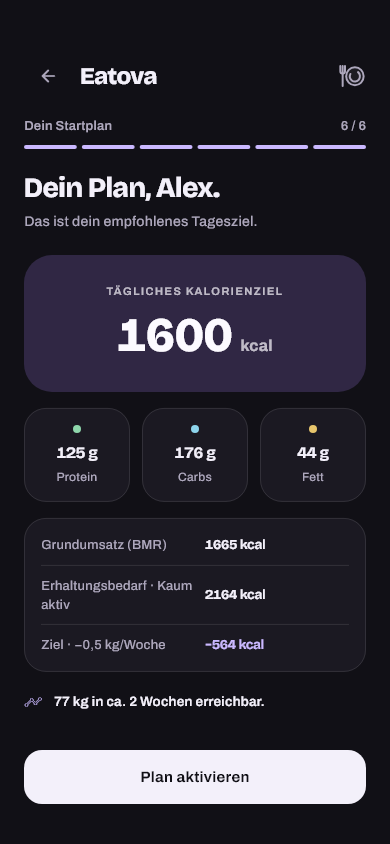
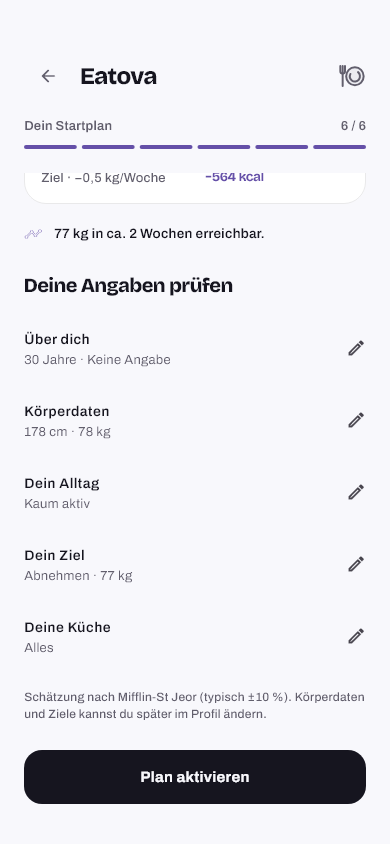

# Authentication and onboarding

## Scope and visual direction

The September 2026 redesign covers email/password login, registration, email
verification and initial profile setup. These are task-oriented native screens:
the primary action remains clear, fields support platform input behavior, and
decoration never delays account access.

The entry surfaces use Eatova's existing Balance Duo palette, Bricolage Grotesque
headings, Archivo body text and custom icon family. Lavender/violet provides
brand emphasis, while the open layout and borderless soft-fill fields retain
the app's input/focus contract. Both themes and German/English are supported.
No global palette, dependency or nutrition-calculation change is part of this
redesign.

## Login and signup revision, 2026-09-17

The revised entry composition uses the open theme background, an enlarged
Eatova wordmark and a short localized headline. Login reads “Wieder da.” /
“Welcome back.”; registration reads “Dein Start.” / “Make it yours.”. The
wordmark, heading and fields share the same start edge inside the bounded,
scrollable form. This replaces the September 16 filled hero and feature row;
the six-step profile setup below is unchanged.

[AuthEntryHeader and AuthModeSelector](../lib/src/widgets/auth/auth_entry_header.dart)
define the entry behavior:

- The wordmark's focus reticle makes one finite movement on entry and when the
  account mode changes. It settles after 720 ms on entry or 440 ms on a mode
  change; it does not run an idle loop. Reduced motion snaps to the resting mark.
- Both account modes remain visible above Google and email sign-in. A violet
  underline follows the selected mode. At narrow widths or large text sizes,
  the options stack with a selected surface fill instead of squeezing labels.
- Registration expands the name field in place. Email and password keep their
  controllers, values and selection while switching modes, including when a
  transition is interrupted. Password autofill changes with the chosen mode.
- Opening the keyboard collapses the headline and supporting copy. The
  wordmark and mode controls remain, while the form stays scrollable to reach
  each field and the primary action.

The shared [wordmark](../lib/src/widgets/shared/eatova_wordmark.dart) retains its
existing resting geometry. It keeps its artwork proportions at large text
sizes and exposes one spoken “Eatova” label. Animation is owned by the auth
header, so other wordmark placements remain static. The focus reticle is a brand
detail; input focus continues to use the existing borderless `field` /
`fieldFocus` fills in
[AuthField](../lib/src/widgets/auth/auth_controls.dart), with no new field ring.

## Startup and signed-in welcome alignment

The lavender startup/welcome surface centers its mark independently of the
greeting's length. Its scroll content now fills at least the available viewport
width after the existing padding, matching the existing minimum-height rule.
This fixes the left shift caused by shrink-wrapped scroll content while keeping
the surface scrollable on short windows and with enlarged text.

The [welcome implementation](../lib/src/widgets/auth/welcome_screen.dart) keeps
the existing profile-ready gate and completion timing. The
[centering regression](../test/widgets/welcome_screen_centering_test.dart)
checks both widget geometry and rendered ring/lettering pixels through loading,
welcome and reduced-motion states. The auth form above remains deliberately
start-aligned; the full-screen welcome mark is centered.

## Six-step setup

The previous flow could require eleven screens. The new flow groups related
questions and removes the passive introductory screen:

1. **Basics:** the personal details used by the existing energy calculation.
2. **Body:** height and current weight together.
3. **Activity:** a practical description of the usual activity level.
4. **Goal:** maintain, lose or gain; target and pace appear when applicable.
5. **Diet:** optional dietary preference, with a clear way to continue without
   choosing a restriction.
6. **Plan:** review the calculated target and edit earlier answers before
   completing setup.

Related controls remain scrollable on small screens and with enlarged text.
Back navigation preserves the draft. A summary edit returns directly to the
summary, without repeating the remaining steps. Numeric ranges come from
`ProfileLimits`, and goal consistency and energy estimates use the existing
model/calculator. Reselecting the current goal must preserve a custom target.

Completing setup does not opt into reminders or trigger a notification
permission prompt. The existing explicit reminder setting remains available.
There is no extra permissions tour, upsell or forced tutorial.

## Behavioral boundaries

- Login, signup, Google sign-in, recovery, resend and email verification retain
  their real repository operations. An exposed Apple sign-in flow is not added.
- Login accepts an existing nonempty password for server validation. New-account
  password rules remain on registration and password creation/change.
- A signup awaiting email confirmation does not unlock authenticated data.
- Credential exchanges must not let a late response replace a newer session or
  undo a sign-out. The native Google account chooser is inside that boundary.
- The profile is completed only after the final user action. The existing
  account-scoped sync/outbox path persists it; returning accounts do not repeat
  setup after a successful save.
- Legal links, sanitized errors, anti-enumeration behavior, OTP cooldowns,
  keyboard access, autofill, reduced motion and accessible control labels remain
  part of the entry contract.

## Verification and delivery

### Rendered previews

These are Flutter test frames with bundled production fonts and synthetic
profiles, not device screenshots. Content scrolls; the plan's edit rows are
shown separately from its first viewport. Entry and welcome frames were
refreshed on September 17. The profile setup frames are from September 16 and
still describe the unchanged six-step flow. The previous entry composition and
its verification remain in the dated handoff and Git history.

| Login, September 17 | Signup, September 17 | Welcome, September 17 |
| --- | --- | --- |
|  |  |  |

| Profile setup, September 16 | Profile setup, September 16 |
| --- | --- |
|  |  |
|  |  |

Reproduce the complete theme/language/text-size matrix locally:

```sh
flutter test test/auth_entry_design_test.dart --dart-define=AUTH_PREVIEW_DIR=build/auth-entry-preview
flutter test test/widgets/welcome_screen_centering_test.dart --dart-define=WELCOME_PREVIEW_DIR=build/welcome-preview
flutter test test/onboarding_redesign_test.dart --dart-define=ONBOARDING_CAPTURE=review
```

### Checks and boundaries

Validation evidence and the protected PR are recorded in the dated
[project handoff](PROJECT_HANDOFF.md). The verification includes real-font
Flutter renders, focused authentication/profile regressions, a combined
signup-to-onboarding-to-returning-login test, strict analysis and the full
Flutter suite with dummy service configuration.

The September 17 native visual review used a separate synthetic auth-preview
package on the `fitpilot_pixel` Android emulator. It covered light/dark themes,
the real Android keyboard and an expanded 800 × 1280 dp window. These checks did
not change the installed production app and are not iOS or physical-device
validation.

Passing local checks and merging the PR do not install a new application.
Physical-device Google account selection, OS keyboard/autofill and real email
delivery require their own device/provider checks. This change does not deploy
backend functions or change live authentication settings.
