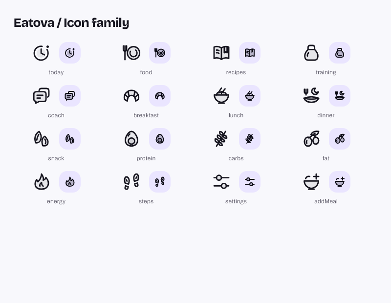

# Today, Food and navigation icon family

The Today metrics, meal slots and bottom tabs now share 16 original vector
pictograms. Their rounded contours, open spaces and subtle inset fills follow
the existing Balance Duo theme. Active tabs have a slightly stronger stroke
and small motif details, alongside the existing selected background and label.

| Surface | Motifs |
| --- | --- |
| Bottom navigation | Day dial, plate and fork, recipe book, kettlebell, conversation |
| Meals | Croissant, grain bowl, evening plate, almonds |
| Today | Egg, wheat, olives, flame, shoe prints, settings faders, add-meal bowl |

## Integration and interaction

`AppSymbol` names the pictograms; `AppIcon` draws them on a shared 24-unit
grid and inherits `IconTheme` size, color and opacity. Optional semantic labels
are supported; decorative glyphs defer to the existing control or metric label.
The painter centers its requested optical size even inside a larger tight badge.

`MealSlotStyle.symbol` replaces three divergent icon mappings. Today, Food,
the shared entry pickers and the recipe meal picker use the same four motifs.
`StepsIcon` retains its public API and uses the shared footprint drawing.

Footer icons increase from 19 to 23 logical pixels. Their vertical padding
decreases by the same total amount, preserving the footer height and Today
first-viewport layout. Tab labels, selected semantics, 44-pixel minimum targets,
callbacks and reduced-motion behavior stay intact. Theme tokens supply all
production colors, including Training's dark footer.

## Real Flutter previews

These images are rendered from the implemented widgets with the app fonts,
frozen 2026-09-14 fixture time and stubbed health data.

| Preview | Image |
| --- | --- |
| Today, light / English | [Open](icon-family-preview/today-light-en-1.0.png) |
| Today, dark / German | [Open](icon-family-preview/today-dark-de-1.0.png) |
| Food, light / English | [Open](icon-family-preview/food-light-en-1.0.png) |
| Meal picker, light / English | [Open](icon-family-preview/meal-picker-light-en-1.0.png) |
| Training footer, dark / English | [Open](icon-family-preview/training-footer-dark-en-1.0.png) |

## Verification

- Flutter 3.47.2, matching CI; strict analysis passes with no warnings or infos.
- All 4,464 tests pass without skips; 95.01% line coverage (CI floor: 88%, generated localization excluded).
- The icon suite checks all 16 small glyphs for distinct, nonempty, unclipped
  rendering, inherited opacity and visible repaint after selection changes.
- A pixel regression catches an 18-pixel icon incorrectly expanding inside a
  44-pixel badge. It failed before the centering fix and passes with the fix.
- Real-screen tests cover light/dark, German/English, 390 x 844 at normal text
  and 320 x 568 at 200% text, all five active tab states, semantic selection,
  touch targets and choosing a meal from the shared sheet.
- Existing Today first-viewport tests pass, including full Steps-card visibility.
- Captures were inspected for the icon board, Today, Food, meal selection,
  Training's active footer and the enlarged-text sheet.

Recreate the captures with `flutter test test/icon_family_test.dart` and
`--dart-define=ICON_CAPTURE=true`, plus the dummy Supabase defines from
[CONTRIBUTING.md](../CONTRIBUTING.md). Output is under `build/icon-family/`.

## Delivery boundary

The branch `design/icon-family` starts at main `767ab93` (PR #87). Delivery
uses a protected PR and merge only after green CI on the reviewed commit,
as authorized by the user. The PR records the final merge. This is an app-code
change; backend deployment and device installation are separate actions.
