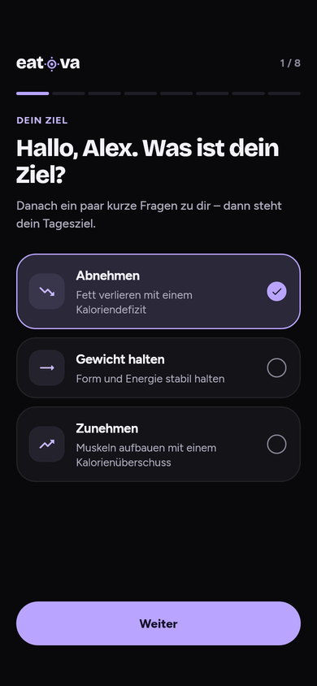
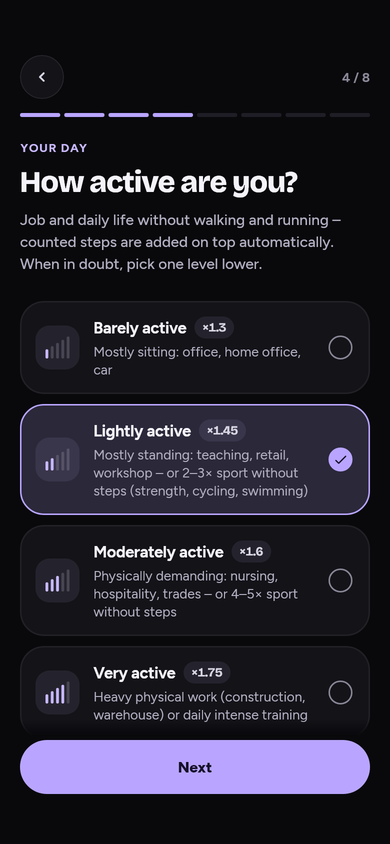
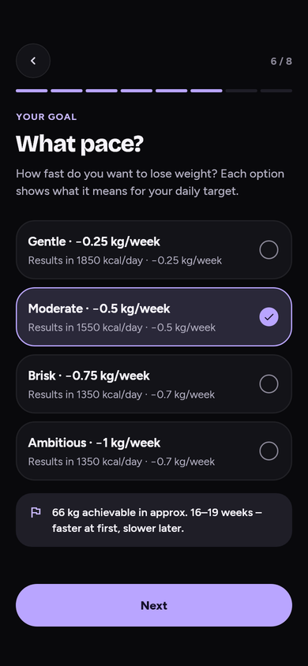
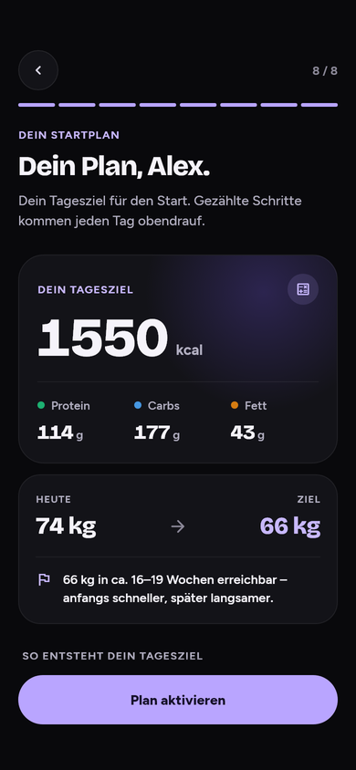

# Onboarding: questions and redesign (2026-10-04)

On 2026-10-04 the owner asked to rethink which questions the onboarding asks
and to rebuild it in the dark-redesign language ("Hinterfrage die Sachen,
schau ob das alles Sinn macht"). The plan is
[W2 in the 2026-10-04 plan](superpowers/plans/2026-10-04-profile-onboarding-light-mode.md).
This record holds the audit, the decisions and the new flow. The entry
screens (login, signup, welcome) are unchanged; see
[authentication and onboarding](AUTH-ONBOARDING-DESIGN.md).

## What every question drives

Traced in the code at e92d1b1. "Plan" means
`KcalCalculator.calculate` (BMR × PAL ± goal delta, floors, 1 % cap).

| Question | Drives | Decision | Reason |
| --- | --- | --- | --- |
| Goal direction (lose, maintain, gain) | `weightGoal` → goal delta through `effectiveWeightGoal`; the Coach context line "Wirksames Gewichtsziel"; whether target and pace are asked | Kept, **moved to step 1** | It is the user's motivation and decides which later questions exist. One tap, three cards. |
| Name | Greeting, avatar initial | Not asked (unchanged) | Comes from registration or the Google account; `firstNameFor` falls back to the e-mail name, so the greeting is never empty. Changing it needs auth metadata, which is out of scope. |
| Biological sex | BMR offset (+5 / −161 / −78), calorie floor (1500 / 1200 / 1350), step length for the step credit | Kept; default "Prefer not to say" (average) | Moves the plan by up to ~170 kcal and sets the floor. The default is honest: no assumption, the average formula. |
| Age | BMR (−5 kcal per year) | Kept, with sex on "About you"; 16 to 100 from `ProfileLimits` | Changes the plan; GDPR Art. 8 minimum stays in one place. A birth date would need a migration. |
| Height | BMR (6.25 kcal per cm), protein reference weight (BMI 25), target BMI hint, step length | Kept, with weight on one screen | Changes the plan and the protein goal. |
| Current weight | BMR, 1 % deficit cap, protein, target window, forecast; the plan weight until the first weigh-in ([weight trend](WEIGHT-TREND.md)) | Kept | The largest single input. |
| Activity (PAL 1.3 to 1.9, without walking) | Maintenance = BMR × PAL | Kept; cards show an intensity mark and the factor | Each level moves the plan by 0.15 × BMR (~250 kcal). Steps still count on top. |
| Target weight | Forecast, target BMI hint, `effectiveWeightGoal` (a target on the wrong side plans maintain); not the kcal | Kept, **own step** after the activity, only for lose or gain with a reachable target | Without a target on the right side, the direction silently becomes maintain. One decision per screen. |
| Pace | Goal delta (capped at 1 % of body weight per week, floored) | Kept, **own step** after the target; every option shows its daily target and real pace, and the forecast follows the selection | Honest numbers need body data and activity first; the forecast makes the trade-off visible before the choice. |
| Diet preference | Recipe pick, recipe shelves (`pickRecipeForNextMeal`, `RecipesScreen.diet`) | Kept, optional, last question; default "Everything", the button reads "Continue without a preference" | Changes the experience, not the plan. |
| Notification opt-in | Reminders | Not asked (unchanged) | Decision of 2026-09-16; `onboarding_notification_opt_in_test` pins it. Permission prompts belong to the explicit Settings choice. |
| Step, water and sleep goals | Today cards only; every step counts on top of the plan | Not asked | Defaults (8000 steps, 2.5 l, 7.5 h) are sensible and editable in Goals; they do not change the plan. |
| Health or step source | Step credit | Not asked | A permission prompt; the Profile card connects it. Same reason as notifications. |
| Manual calorie goal | `manualEnergy` | Not asked | The computed plan is the start; Goals offers the manual mode. |
| Sex-specific start values for height and weight | — | Considered, rejected | Numbers would move when the sex answer changes. The averages (178 cm, 78 kg) are one slider drag from typical values. |
| Answers on the plan | Edit jumps | Kept, now with target and pace rows | A goal edit used to return straight to the plan and silently use a default target and pace. |

## The flow

1. **Goal** — "Hi Alex, what's your goal?" Lose, maintain or gain.
2. **About you** — biological sex (three tiles) and age.
3. **Body** — height and current weight.
4. **Activity** — five levels with intensity marks and the PAL factor.
5. **Target weight** — only for lose or gain with a reachable target. A
   target nobody chose follows today's weight (5 kg along the direction).
6. **Pace** — only with a target. Every option names its daily target and
   real pace; the forecast below follows the selected pace.
7. **Diet** — optional.
8. **Plan** — the daily target (counting from maintenance to the target, so a
   deficit is seen), macros, today's weight → target with the forecast and the
   target BMI hint, the safety note when a limit changed the pace, how the
   target is computed, and the answers.

Maintaining asks six questions; losing or gaining eight. The progress counts
only the asked steps and is announced as one live region ("Your goal, step 1
of 8").

## Rules that changed

- **Order:** the goal is the first question; target and pace are their own
  steps after the activity.
- **Target default:** an unchosen target follows the current weight. The goal
  is asked before the weight, so a default fixed at that moment would describe
  the starting weight instead of the user's. A stored target counts as chosen
  only while it still means the stored direction; the model default (78 kg
  "to lose" at 78 kg) used to open on 77 kg.
- **Plan edits:** a goal edit walks target and pace before returning to the
  plan; any other edit returns after one question. Back walks the edit
  backwards, then returns to the plan.
- **Steppers:** disabled at the window edge instead of doing nothing; holding
  repeats a step every 90 ms without losing steps between frames.

Unchanged: the `UserProfile` fields and persistence, the completion lifecycle
(`onComplete` → `completeOnboarding`, one commit, retry after a storage
failure, `CommitDismissGuard`), account isolation (no new storage), the
`ProfileLimits` ranges and the minimum age of 16, the one target window rule
in `user_profile.dart`, the calorie rules of the
[2026-08-21 review](REVIEW-KCAL-2026-08-21.md) and the
[weight trend](WEIGHT-TREND.md), the effective-pace display (B2), and system
Back (one step back; the first step releases the root route).

## Design

- **Files:** `lib/src/screens/onboarding_screen.dart` keeps the public
  `OnboardingScreen`, the answers, the rules and the navigation. The widgets
  live in `lib/src/screens/onboarding/`: models (steps, directions, the
  forecast sentence), chrome (header, step frame, captions), controls (option
  cards, choice tiles, number picker) and the question and plan steps.
- **Selection:** the settings pickers' language. The chosen card takes the
  accent tint, an accent outline and a filled accent radio with a check; text
  stays `ink`. The outline and the radio carry the state at 3:1 or more in
  both palettes (`auswahl_sprache_verwendung_test`).
- **Number picker:** the soft `field` capsule without an outline; it lightens
  to `fieldFocus` while a stepper or the slider has focus. Big number, round
  accent-tint steppers, accent slider.
- **Plan hero:** the Goals hero's language: `surf`, the violet glow, a 60 px
  number, macro tones on dots only.
- **Motion:** steps fade and slide 6 % in the direction of travel (280 ms);
  selections ease in 180 ms; the plan sections stagger in and the daily target
  counts. Reduced motion shows every end state at once.
- **Large text:** at 2x on a 320 px phone the option cards put the mark and
  radio above the text, the breakdown puts each value under its label, and
  titles and big numbers are capped (1.6x and 1.4x) as large text. Content
  scrolling under the header or toward the button fades over 16 px.
- **Light mode:** tokens only, no hardcoded colors; the selection and macro
  contracts are already tested in both palettes.

| Goal | Activity | Pace | Plan |
| --- | --- | --- | --- |
|  |  |  |  |

These are Flutter test frames with the bundled fonts at 390 × 844 (half
resolution), not device screenshots. Every step in German and English, at
390 px and at 320 px with 2x text, comes from:

```sh
flutter test test/design/onboarding_capture_test.dart --dart-define=DARK_REDESIGN_CAPTURE=true
```

The PNGs land in `build/dark-redesign/onboarding-*.png`.

## Verification

- `test/onboarding_flow_test.dart` pins every changed rule. Ten mutations of
  the new code (the old target default, the old start value, a goal edit that
  returns at once, the old order, target and pace for maintain, an enabled
  stepper at the edge, repeats from a stale value, a plan without the BMI
  hint, a forecast that ignores the selection, a reveal counting from zero)
  each turn one of its tests red.
- The existing suites keep their guarantees in the new flow: validation and
  limits (`onboarding_screen_test`), the target window and its edges
  (`onboarding_target_consistency_test`, `j_onboarding_zielgewicht_deckel_test`),
  completion and persistence (`onboarding_completion_lifecycle_test`,
  `local_commit_ui_test`, `pending_commit_input_test`, the flows), system Back
  (`home_page_onboarding_pop_test`), no notification prompt, accessibility
  (`fixlauf_b_onboarding_a11y_test`, `a11y_reduced_motion_test`) and the
  palettes (`test/theme`).
