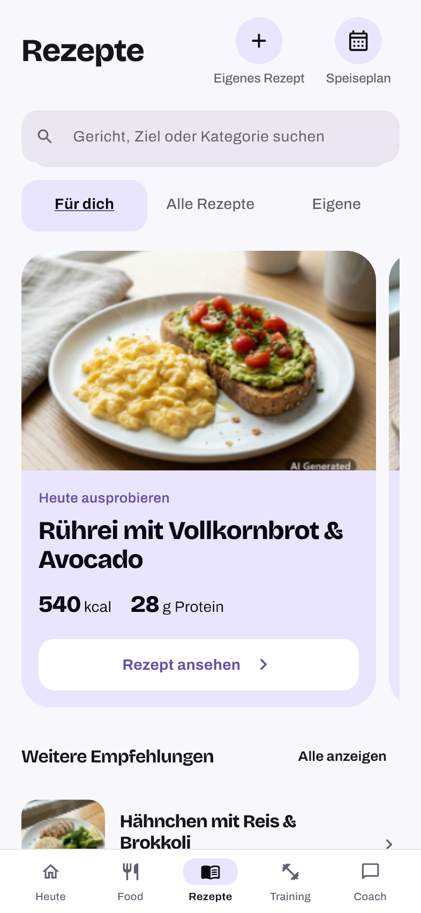
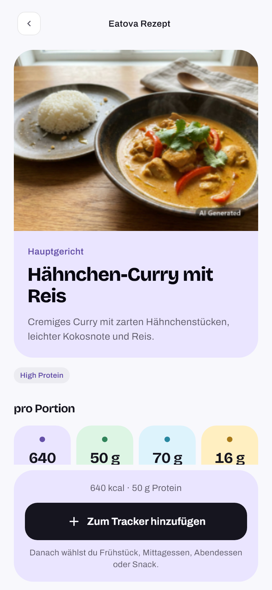
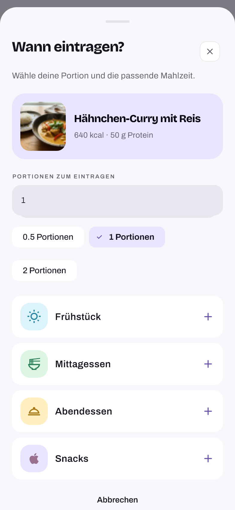
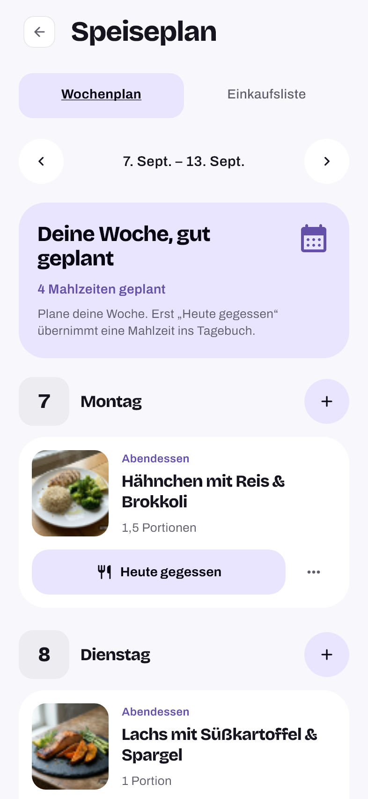
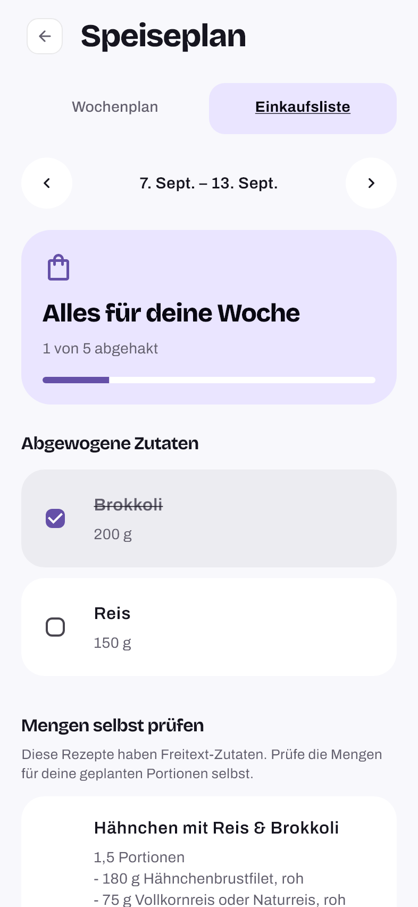
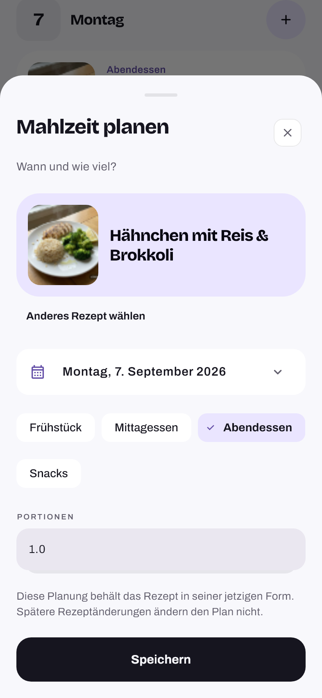

# Recipes — Spotlight

The user selected concept 05, Recipe Spotlight, on 2026-09-13. The recipe family
now continues Today's Balance Duo and Food's Thumb First design with the existing
Archivo/Bricolage typography, lavender, mint, sky and butter surfaces, and shared
theme radii. The mockup is implemented as native Flutter UI with real recipe data.

## Design and behavior

- Recipes opens on **For you** with a photo-led recommendation carousel. Recipe
  titles, calories and protein sit below the photo on lavender, with a clear view
  action. Open photo rows continue the library below. Daily rotation, dietary
  preferences and goal recommendations retain the existing calculations.
- **All recipes** contains search results and category filters. **Own** is a
  persistent section, including a useful empty state. Saving a new recipe opens
  Own with the new entry visible. Search text, filters and scroll retention across
  app tabs remain covered. Delete/undo and the existing device-only photo lifecycle
  retain their persistence and account guards.
- Recipe details combine the photo, title and description, followed by four
  pastel nutrition tiles, ingredient rows and numbered preparation steps. The
  logging action stays at the bottom on normal phones; short windows and large
  text let it scroll with the content. Portions and meal slots are confirmed in a
  matching sheet before anything is added to the diary.
- Meal Plan and Shopping List share local navigation and week controls. The plan
  keeps all seven days visible, with a weekly summary, photo cards, explicit
  logging and an edit/delete menu. The editor shows the selected recipe, date,
  meal slot and portions. Selecting a recipe after scrolling resets the sheet to
  its heading; large text receives the full width below the photo.
- Shopping List shows weekly progress, clear checked states and completion copy.
  Checked rows stay in place. Quantified ingredients and free-text recipe
  reminders remain distinct; no quantities are guessed. Week changes preserve
  each week's checks. Loading, retry and empty states use the same visual system.

Services, recipe calculations, snapshots, encrypted cache/outbox, account
isolation and explicit-confirmation rules are preserved. Planned snapshots can
reuse a bundled photo only for an exact catalog slug/path pair; missing local
photos still get the existing placeholder. No backend, schema, dependency or
lockfile changes are required.

## Rendered preview

| Recipes | Details | Portion sheet |
| --- | --- | --- |
|  |  |  |

| Meal Plan | Shopping List | Plan editor |
| --- | --- | --- |
|  |  |  |

These are rendered Flutter views using catalog recipes and local test data.

## Verification

Verified with the CI-pinned Flutter 3.47.2:

- All 4,379 Flutter tests passed, without skips or failures.
- Coverage: 95.19% (25,771/27,073 lines), excluding generated localization
  as CI does; the 88% floor is unchanged.
- Strict analyzer: no warnings or infos. Android x64 debug APK built with dummy
  configuration. Existing AGP/Kotlin future-support advisories remain.
- Direct source/diff review and 21 real-font visual cases completed. Native-device
  installation is separate from these checks.

Source and diff review covered navigation, responsive constraints, localization,
photo resolution and the existing persistence callbacks. Regression tests catch
the scrolled editor starting midway through the form and an invalid catalog photo
association; both were checked against deliberately faulty local variants before
restoring the fixes. Detail-footer bounds prevent an expanding action area from
taking over the viewport.

The existing app flows now use the visible local tabs and planner back action.
Their assertions still cover diary totals, selected dates, Coach confirmation,
delete/undo, offline feedback and local-photo retention/deletion. The obsolete
forest-badge design exception was removed from the theme rule's allowlist.

Real-font Flutter captures cover Recipes, details, portion sheet, planning,
shopping, plan editor and the Own empty state: German/light, English/dark and
320-pixel German/2x text, 21 cases with fatal hit-test warnings and no overflows.
Local screenshots, mutation evidence and logs are in `.agents/recipe-spotlight/`.
These checks do not establish native keyboard behavior or a physical-device
installation.

Delivery uses `design/recipe-spotlight`, based on main `38bd0e0` (PR #83), through
the protected-main PR workflow after green CI. The delivery PR records the merge.
A new client build must be installed to see these changes on a device.
