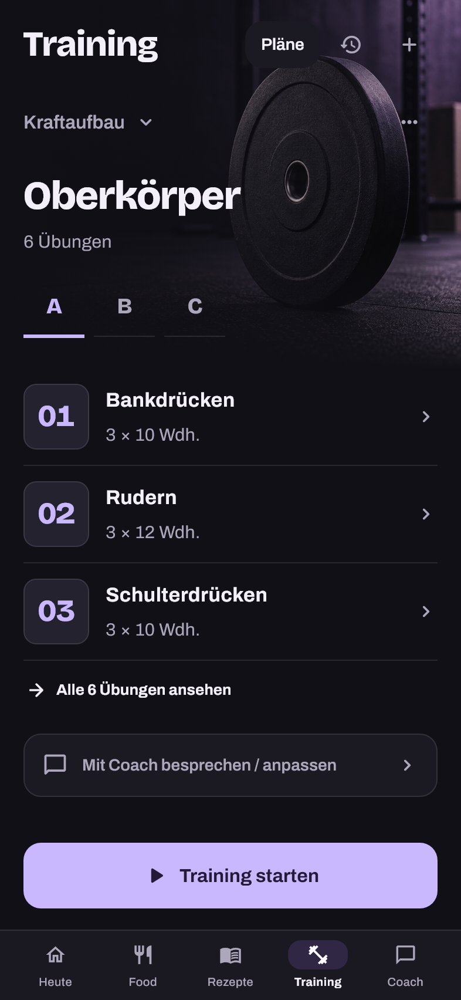
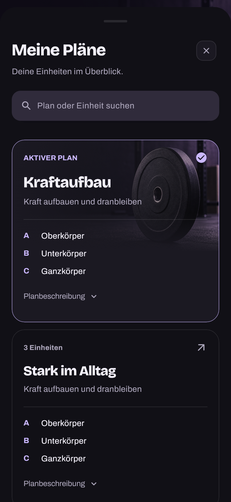
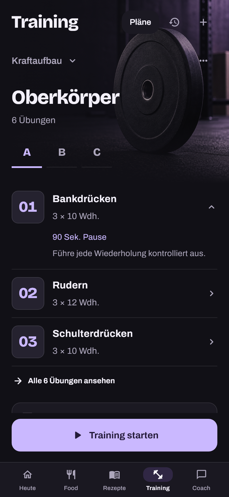
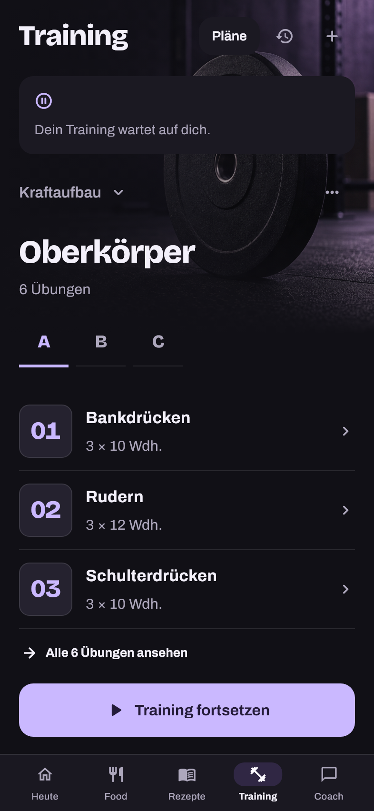

# Training — Nachtstudio

Concept 09, selected on 2026-09-13, is implemented as a native Flutter Training
page. The dark studio photography, expressive headings, lavender start action
and open exercise rows give Training its own character within Eatova.

## Design and behavior

- Training uses the existing dark Eatova tokens in either app appearance. The
  shell, bottom navigation and native system bars match the studio; leaving
  Training restores the app appearance. Other tabs retain their design.
- The artwork is bundled and works offline. It is decorative equipment
  photography, not a generated picture of the user's exercise. Numbered exercise
  tiles work for arbitrary custom plans without guessing their movements.
- A–G select the actual workouts in a plan. The first three prescribed exercises
  form a compact preview. All exercises can be expanded, and each row reveals
  its rest interval and notes. No data is discarded or inferred.
- Start remains at the foot of a normal phone. Short windows and large text
  scroll the action with the content. Existing sessions expose Resume instead
  of a second Start. Feedback reserves its own space so retry stays tappable.
  Hidden Training tabs and covered routes yield their toast host.
- The plan library shows the active plan first with studio artwork, goal and
  lettered workout overview. Search matches plan names, goals and workouts.
  Descriptions expand without selecting a plan. Empty/no-result states keep
  manual creation and Coach accessible.
- Opening the editor or Coach from the library does not save or adopt a plan.
  Selection captures its account-bound callback and rejects a plan removed
  while the sheet was open. Removing an implicit active plan resets selection
  to the replacement plan's first workout.
- Existing editing, confirmed deletion, history, player recovery, explicit Coach
  adoption, account isolation and persistence continue through their existing
  callbacks. No backend, schema or dependency changes are required.

## Rendered preview

| Training | Plan library |
| --- | --- |
|  |  |

| Exercise notes | Resume |
| --- | --- |
|  |  |

These are real Flutter renders with bundled fonts and illustrative plan data.

## Verification

- Flutter 3.47.2 / Dart 3.13.2, matching CI; strict analysis passes.
- Full Flutter suite: 4,390 passing tests, 95.25% line coverage (26,121/27,423;
  generated localization excluded, required floor 88%). The final typography,
  image fade and accessibility refinements pass 94 focused tests. PR CI runs
  the full suite again against the final commit.
- The screen-reader regression fails without the semantic tap action and passes
  with it, including actual workout selection. Recovery/retry, stale plan
  selection, implicit plan replacement, reduced motion, toast routing and
  native bar restoration have behavior coverage.
- Thirteen real-font Flutter renders cover German/English, normal and 200% text,
  narrow portrait and landscape, keyboard, loading, error, empty and resume.
  Word geometry is checked with the actual bundled fonts.
- Android debug APK builds from the final source with dummy Supabase defines.
- Direct source/diff review covers state retention, modal results, accessible
  actions and toast routing. No backend, schema or dependency rollout is needed.

Detailed logs, the image prompt and the remaining responsive/state renders are
kept in the ignored `.agents/training-nightstudio/` evidence directory. The
topic branch is `design/training-nightstudio`, based on main `ab7d9f3` (Recipe
Spotlight PR #84). Delivery follows the protected-main PR workflow after green
CI. The PR records the final push/merge; a physical-device installation is a
separate delivery step.
