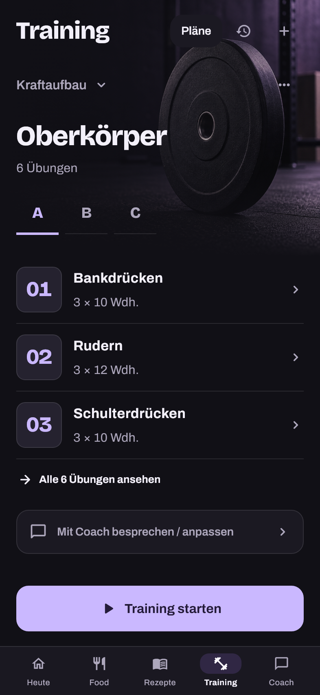
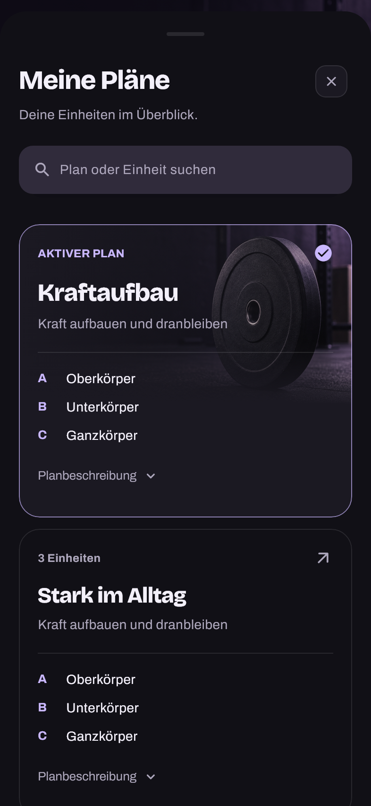
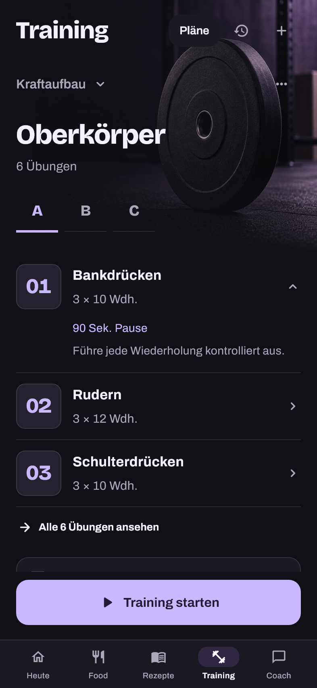
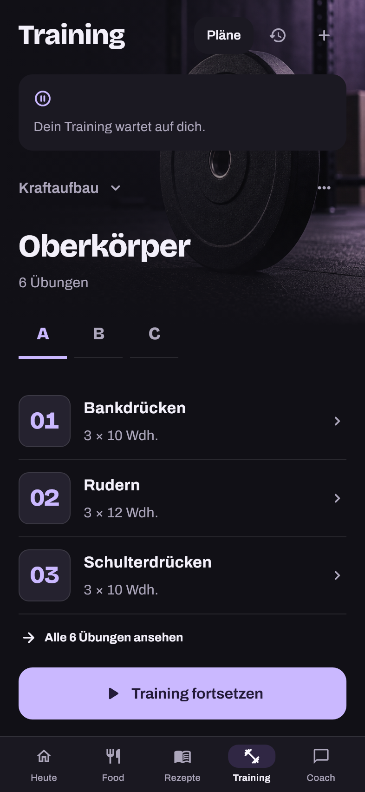

# Training — Nachtstudio

> **Superseded on the tab root by the dark redesign (2026-09-28).** The app is
> dark-only now, so the Training-only forced theme (`TrainingStudioTheme`,
> `TrainingStudioChrome`) is gone and the tab follows the app theme. The root
> shows the design's header, "This week" strip, next-workout card, Quick
> start, Weekly volume and Recent, fed by the store's training derivations
> (`models/training_insights.dart`). Workouts are chosen through Quick start
> instead of A–G tabs, and plan edit/delete sit behind the card's round
> adjust button. The plan library (with its studio artwork), editor, player
> and history below are unchanged. Report:
> `.agents/dark-redesign-2026-09-28/worktree/.superpowers/sdd/plan/task-5-report.md`.

Concept 09, selected on 2026-09-13, is implemented as a native Flutter Training
page. The dark studio photography, expressive headings, lavender start action
and open exercise rows give Training its own character within Eatova.

## Design and behavior

- Training uses the existing dark Eatova tokens in either app appearance. The
  shell, bottom navigation and native system bars match the studio; leaving
  Training restores the app appearance. Other tabs retain their design.
- The artwork is bundled and works offline. It is decorative equipment
  photography, not a generated picture of the user's exercise. Numbered exercise
  tiles work for arbitrary custom plans without guessing their movements.
- A–G select the actual workouts in a plan. The first three prescribed exercises
  form a compact preview. All exercises can be expanded, and each row reveals
  its rest interval and notes. No data is discarded or inferred.
- Start remains at the foot of a normal phone. Short windows and large text
  scroll the action with the content. Existing sessions expose Resume instead
  of a second Start. Feedback reserves its own space so retry stays tappable.
  Hidden Training tabs and covered routes yield their toast host.
- The plan library shows the active plan first with studio artwork, goal and
  lettered workout overview. Search matches plan names, goals and workouts.
  Descriptions expand without selecting a plan. Empty/no-result states keep
  manual creation and Coach accessible.
- Opening the editor or Coach from the library does not save or adopt a plan.
  Selection captures its account-bound callback and rejects a plan removed
  while the sheet was open. Removing an implicit active plan resets selection
  to the replacement plan's first workout.
- Existing editing, confirmed deletion, history, player recovery, explicit Coach
  adoption, account isolation and persistence continue through their existing
  callbacks. No backend, schema or dependency changes are required.

## Workout player (list, 2026-10-03)

Decision D1 (owner, 2026-10-03): the player is a list of exercise cards in
the existing dark studio look (spec
`docs/superpowers/specs/2026-10-03-training-flow-and-coach-log-design.md`
§5). Code: `screens/training/training_player_screen.dart`, its widgets in
`screens/training/player/`, the ledger in
`services/training_session_controller.dart`.

- **One tap per set.** ✓ completes a repetition set; a timed set has ▶ (3 s
  get-ready), counts down, completes at zero and offers "Done early". The
  ledger stays a sequential prefix: only the active set's ✓ is enabled, the
  others show a visibly disabled ✓ (supersets are out of scope). Tapping the
  most recent completed ✓ undoes it (its rest and alert end, its values
  become the row draft). The active card's menu: Skip set, Complete N
  remaining as planned, Skip exercise. Pause/Resume and Discard sit in the
  header menu.
- **Prefill (A2).** Reps are planned reps. Weight for set *k*: a weight
  changed earlier in this exercise carries forward, else Last time set *k*
  (or its last set), else empty; Last-time sessions without any weight are
  ignored (`lastWeightedTrainingPerformanceFor`; the log editor's planned
  sets use the same rule). Last time is computed once per route; its cell
  copies into the active row on tap. Prefilled values are muted until the
  set's ✓.
- **Layout (A3).** Header: title, sets done/total, active time, Finish, menu.
  Done exercises collapse to "3/3 sets · 10/8/8 · 80–90 kg" (the one just
  finished stays open through its rest); upcoming ones show the plan. The
  active row is dominant (✓ 56 dp) and scrolls into view on activation and
  resume. ✓ and a drag on the list close the keyboard; fields use Done. The
  rest bar is pinned at the bottom (mm:ss 36 pt, −15 s, +15 s, Skip) and
  expands to a full-screen rest view; ✓ on the next set ends a rest early.
  +15 s is off while it would pass the planned rest (the cap of A4).
- **Time keeps running (A4).** A running rest or timed set is a UTC deadline
  (`phase_ends_at`, local-only). Background, lock, covering pages and dialogs
  never pause; only the menu's Pause, Save & leave and Finish do (a failed
  completion stays paused until Retry resolves). On resume
  `catchUp` completes a timed set at its deadline and runs its rest from
  there; a rest that ended unseen leaves the next timed set waiting for ▶.
  After process death a running rest continues and a timed set whose
  deadline passed waits at zero for ✓. Rest follows every completed set
  except the workout's final one, also between exercises (with the completed
  exercise's rest). Completion times are clamped to the start; `startedAt` is
  the first ✓ or ▶; a save more than 5 minutes after the last set finishes
  at that set.
- **Alerts (A5).** One local notification per running phase under
  `restAlertIdForSession`, scheduled at phase start with generic texts;
  opening the player first cancels whatever an earlier process planned.
  ✓/Skip/Undo/Pause/Finish/Discard/leaving and closing the route cancel it.
  The first workout shows one explainer before the system prompt
  (`RestAlertPermissionGate`, once per device: after "Not now" only the
  chip remains);
  with alerts off the rest bar shows a quiet "Alerts off" chip that opens
  the notification settings. A rest or interval that ends in the foreground
  vibrates once. The home page pins scheduling to the account that opened
  the player (`GuardedRestAlertScheduler`).
- **Keep awake (A6).** Owner `training-player` holds the display only while a
  timed set, or the rest leading into one, runs with the player on top
  (ruling R16: owners never release each other's hold).
- **Finishing (A7).** Finish opens a sheet (it also opens itself after the
  last set): summary, note and an honest primary. With open sets: "Save N
  sets (skip the rest)", "I did the rest — log as shown", "Keep training";
  with no completed set only Discard and Keep training. A refused checkpoint
  (`onPersist` → false, the plan changed) shows "not stored" and Finish still
  saves the frozen plan copy. Leaving then never promises a saved place: back
  asks "Leave without saving?" with Finish (when a set is done), Leave
  without saving (no write) and Stay; a Save & leave that is refused keeps
  the player open and asks the same. When a failed completion is still
  pending, Retry stays visible and the dialog's Finish retries that
  completion, so a refused place never leaves the player without an exit.
- **Writes.** Actions checkpoint at once; field and note edits are debounced
  (600 ms) and flushed on any lifecycle change, cover, terminal intent and
  dispose. Terminal intents still win over older checkpoints; failures stay
  sanitized and retryable.
- **Accessibility.** Set done, rest start and rest over are announced with
  `SemanticsService.sendAnnouncement`; ✓/▶ carry "Complete set 2" style
  labels; 320 px and 2.0 text reflow (the rest bar scrolls within 40 % of
  the height).

### Superseded rules (spec §4)

| Old rule (source) | New rule |
|---|---|
| Background/covered routes pause; nothing resumes (TRAINING-DESIGN-2026-09-08.md "Workout player", handoff) | Rest and timed intervals run on wall-clock deadlines; only an explicit pause or process death stops them |
| Pause/resume is the dominant control; Next/Previous visible | ✓ per set is dominant; pause, skip and undo live on the row / exercise menu |
| No notifications | One rest/interval alert per phase, generic text |
| Recovery always paused | Recovery continues a still-running rest; a timed interval whose deadline passed during process death waits at zero for ✓ |
| No rest after an exercise's last set | Rest after every completed set except the workout's final set |
| Rep sets need Start | ✓ completes a rep set directly |

The tests that encoded the old rules were rewritten and renamed:
`training_session_controller_test.dart`, `training_player_screen_test.dart`,
`training_automatic_flow_test.dart`, `training_qa/player_lifecycle_test.dart`,
`training_qa/timer_recovery_test.dart`; the lock scenario is
`training_qa/rest_survives_background_test.dart`.

## Rendered preview

| Training | Plan library |
| --- | --- |
|  |  |

| Exercise notes | Resume |
| --- | --- |
|  |  |

These are real Flutter renders with bundled fonts and illustrative plan data.

## Verification

- Flutter 3.47.2 / Dart 3.13.2, matching CI; strict analysis passes.
- Full Flutter suite: 4,390 passing tests, 95.25% line coverage (26,121/27,423;
  generated localization excluded, required floor 88%). The final typography,
  image fade and accessibility refinements pass 94 focused tests. PR CI runs
  the full suite again against the final commit.
- The screen-reader regression fails without the semantic tap action and passes
  with it, including actual workout selection. Recovery/retry, stale plan
  selection, implicit plan replacement, reduced motion, toast routing and
  native bar restoration have behavior coverage.
- Thirteen real-font Flutter renders cover German/English, normal and 200% text,
  narrow portrait and landscape, keyboard, loading, error, empty and resume.
  Word geometry is checked with the actual bundled fonts.
- Android debug APK builds from the final source with dummy Supabase defines.
- Direct source/diff review covers state retention, modal results, accessible
  actions and toast routing. No backend, schema or dependency rollout is needed.

Detailed logs, the image prompt and the remaining responsive/state renders are
kept in the ignored `.agents/training-nightstudio/` evidence directory. The
topic branch is `design/training-nightstudio`, based on main `ab7d9f3` (Recipe
Spotlight PR #84). Delivery follows the protected-main PR workflow after green
CI. The PR records the final push/merge; a physical-device installation is a
separate delivery step.
